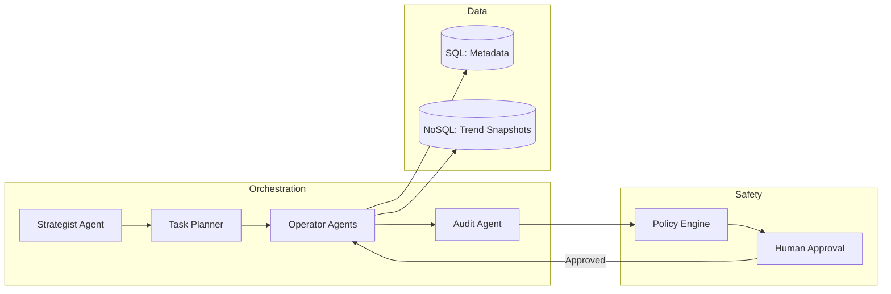

# Architecture Strategy

## Goal
Establish a spec-first, agent-ready architecture for Project Chimera that enables safe, scalable autonomous influencer operations.

## Agent Pattern
**Recommended Pattern:** Hierarchical Swarm
- **Why:** Separates high-level planning (Strategist) from execution (Operators) and verification (Auditors).
- **Benefits:** Clear responsibility boundaries, easier safety enforcement, and parallelized task execution.

## Human-in-the-Loop (Safety Layer)
**Approval Gates:**
1. **Pre-Publish Gate:** Human approves final content package (copy, visuals, metadata).
2. **Policy Gate:** Automated policy checks run first, then human review for high-risk content.

## Data Layer
**Choice:** Hybrid (SQL + NoSQL)
- **SQL (PostgreSQL):** Core entity relationships, analytics, and integrity.
- **NoSQL (Document Store):** High-velocity, semi-structured trend and engagement snapshots.

## High-Level Architecture (Mermaid)

## OpenClaw Alignment
Project Chimera should advertise agent availability, capabilities, and status to the OpenClaw Agent Social Network using a standard status protocol (see specs/openclaw_integration.md).

## Risks & Mitigations
- **Hallucination Risk:** Enforce spec-first workflow and contract tests.
- **Security Risk:** Minimize secrets, require vault integration, and run policy checks.
- **Scalability Risk:** Use asynchronous processing and queue-based tasking.
