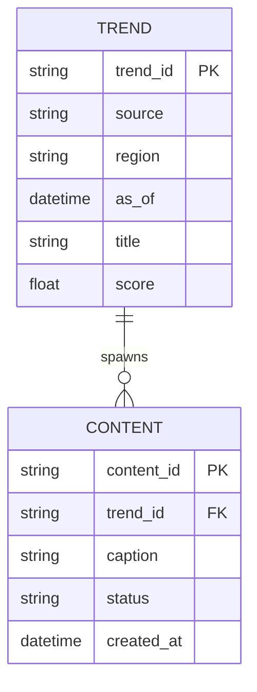

# Technical Specification

## API Contracts
### Trend Fetcher
**Request**
```json
{
  "source": "tiktok",
  "region": "US",
  "limit": 20
}
```

**Response**
```json
{
  "source": "tiktok",
  "region": "US",
  "as_of": "2026-02-04T00:00:00Z",
  "trends": [
    {
      "trend_id": "string",
      "title": "string",
      "score": 0.0,
      "metadata": {
        "language": "en",
        "tags": ["string"]
      }
    }
  ]
}
```

### Content Draft
**Request**
```json
{
  "trend_id": "string",
  "tone": "playful",
  "length": "short"
}
```

**Response**
```json
{
  "content_id": "string",
  "caption": "string",
  "hashtags": ["string"],
  "assets": [
    {"type": "image", "uri": "string"}
  ]
}
```

## Database Schema (ERD)


## Orchestration Schemas
### Agent Task (Planner -> Worker)
```json
{
  "task_id": "uuid-v4-string",
  "task_type": "generate_content | reply_comment | execute_transaction",
  "priority": "high | medium | low",
  "context": {
    "goal_description": "string",
    "persona_constraints": ["string"],
    "required_resources": ["mcp://twitter/mentions/123", "mcp://memory/recent"]
  },
  "assigned_worker_id": "string",
  "created_at": "timestamp",
  "status": "pending | in_progress | review | complete"
}
```

### MCP Tool Definition (JSON Schema)
```json
{
  "name": "post_content",
  "description": "Publishes text and media to a connected social platform.",
  "inputSchema": {
    "type": "object",
    "properties": {
      "platform": {
        "type": "string",
        "enum": ["twitter", "instagram", "threads"]
      },
      "text_content": {
        "type": "string",
        "description": "The body of the post/tweet."
      },
      "media_urls": {
        "type": "array",
        "items": {"type": "string"}
      },
      "disclosure_level": {
        "type": "string",
        "enum": ["automated", "assisted", "none"]
      }
    },
    "required": ["platform", "text_content"]
  }
}
```

## Persona & Memory Contract
- Personas SHALL be defined via SOUL.md files with voice, directives, and backstory.
- Context assembly SHALL merge:
  - Short-term episodic memory (Redis)
  - Long-term semantic memory (Weaviate)
  - Persona definition (SOUL.md)

## HITL Confidence Policy
- High Confidence (> 0.90): Auto-approve.
- Medium Confidence (0.70 - 0.90): Async human approval.
- Low Confidence (< 0.70): Reject and retry.
- Sensitive topics MUST be routed to HITL regardless of confidence.

## Non-Functional Requirements
- All agent actions emit audit logs.
- Safety gates must be enforced before publish actions.
- Test suite must validate API contracts.
