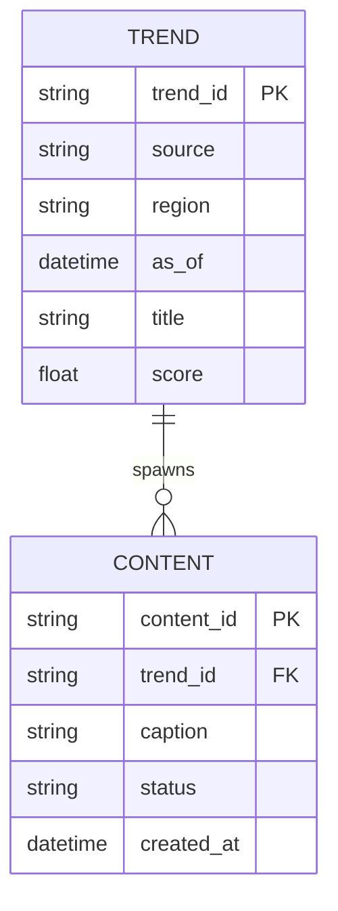

# Technical Specification

## API Contracts
### Trend Fetcher
**Request**
```json
{
  "source": "tiktok",
  "region": "US",
  "limit": 20
}
```

**Response**
```json
{
  "source": "tiktok",
  "region": "US",
  "as_of": "2026-02-04T00:00:00Z",
  "trends": [
    {
      "trend_id": "string",
      "title": "string",
      "score": 0.0,
      "metadata": {
        "language": "en",
        "tags": ["string"]
      }
    }
  ]
}
```

### Content Draft
**Request**
```json
{
  "trend_id": "string",
  "tone": "playful",
  "length": "short"
}
```

**Response**
```json
{
  "content_id": "string",
  "caption": "string",
  "hashtags": ["string"],
  "assets": [
    {"type": "image", "uri": "string"}
  ]
}
```

## Database Schema (ERD)


## Orchestration Schemas
### Agent Task (Planner -> Worker)
```json
{
  "task_id": "uuid-v4-string",
  "task_type": "generate_content | reply_comment | execute_transaction",
  "priority": "high | medium | low",
  "context": {
    "goal_description": "string",
    "persona_constraints": ["string"],
    "required_resources": ["mcp://twitter/mentions/123", "mcp://memory/recent"]
  },
  "assigned_worker_id": "string",
  "created_at": "timestamp",
  "status": "pending | in_progress | review | complete"
}
```

### MCP Tool Definition (JSON Schema)
```json
{
  "name": "post_content",
  "description": "Publishes text and media to a connected social platform.",
  "inputSchema": {
    "type": "object",
    "properties": {
      "platform": {
        "type": "string",
        "enum": ["twitter", "instagram", "threads"]
      },
      "text_content": {
        "type": "string",
        "description": "The body of the post/tweet."
      },
      "media_urls": {
        "type": "array",
        "items": {"type": "string"}
      },
      "disclosure_level": {
        "type": "string",
        "enum": ["automated", "assisted", "none"]
      }
    },
    "required": ["platform", "text_content"]
  }
}
```

## Persona & Memory Contract
- Personas SHALL be defined via SOUL.md files with voice, directives, and backstory.
- Context assembly SHALL merge:
  - Short-term episodic memory (Redis)
  - Long-term semantic memory (Weaviate)
  - Persona definition (SOUL.md)

## HITL Confidence Policy
- High Confidence (> 0.90): Auto-approve.
- Medium Confidence (0.70 - 0.90): Async human approval.
- Low Confidence (< 0.70): Reject and retry.
- Sensitive topics MUST be routed to HITL regardless of confidence.

## Non-Functional Requirements
- All agent actions emit audit logs.
- Safety gates must be enforced before publish actions.
- Test suite must validate API contracts.

## Data Management
### Storage Choices
- PostgreSQL: authoritative relational store for agents, tasks, content, reviews, and audit logs.
- MongoDB (or compatible document store): high-velocity trend and engagement snapshots.
- Redis: short-lived queues, rate limiting counters, and episodic cache.
- Weaviate (or compatible vector DB): semantic memory and retrieval.

### Core Schemas
#### Relational (PostgreSQL)
- agent
  - agent_id (PK), persona_id, status, created_at, updated_at
- trend
  - trend_id (PK), source, region, as_of, title, score, language, created_at
- content
  - content_id (PK), trend_id (FK), caption, status, created_at, updated_at
- content_asset
  - asset_id (PK), content_id (FK), asset_type, uri, checksum
- review_decision
  - review_id (PK), content_id (FK), reviewer_id, decision, rationale, decided_at
- task
  - task_id (PK), agent_id (FK), task_type, priority, status, created_at, completed_at
- audit_log
  - log_id (PK), actor_type, actor_id, action, resource_type, resource_id, metadata_json, created_at

#### Document (MongoDB)
- trend_snapshots
  - _id, source, region, as_of, trends[], ingestion_id, checksum
- engagement_snapshots
  - _id, platform, content_id, metrics{}, as_of, ingestion_id

### Data Lifecycle
1) Ingest: MCP tools pull external signals into staging collections.
2) Normalize: schema validation, dedupe by checksum, and type enforcement.
3) Persist: write to snapshot store, then upsert relational summaries.
4) Serve: APIs read from relational store for workflows; analytics read from snapshots.
5) Archive: snapshot partitions older than 90 days to cold storage.
6) Delete: PII removal requests must cascade to snapshots and audit logs via redaction markers.

### Migration Strategy
- All schema changes are versioned with migrations (e.g., Alembic for SQL; Mongo migrations for documents).
- Backward-compatible changes required for one minor release window.
- Data backfills must be idempotent and tracked via migration ledger.

### High-Velocity Metadata Handling
- Snapshot collections are time-partitioned by day.
- Trend data stored with source + region composite indexes.
- Audit logs stored append-only with monthly partitioning.

## Backend Services
### Service Boundaries
- Orchestrator API: task creation, assignment, and state transitions.
- Trend Service: ingestion, normalization, and query for trends.
- Content Service: draft generation tracking and asset management.
- Review Service: HITL decisions and audit trail linkage.
- Publish Service: platform dispatch, scheduling, and status callbacks.
- Audit Service: centralized write-only log collector.
- MCP Gateway: single egress for tool calls with schema enforcement.

### Inter-Service Communication
- Command flows via REST/JSON; async events via queue (e.g., Redis streams).
- All internal calls require service tokens and include request_id for traceability.

### API Contracts (Additional)
#### Review Decision
**Request**
```json
{
  "content_id": "string",
  "reviewer_id": "string",
  "decision": "approve|reject|needs_changes",
  "rationale": "string"
}
```
**Response**
```json
{
  "review_id": "string",
  "content_id": "string",
  "status": "recorded",
  "decided_at": "2026-02-04T00:00:00Z"
}
```

#### Publish Request
**Request**
```json
{
  "content_id": "string",
  "platform": "twitter|instagram|tiktok|youtube",
  "schedule_at": "2026-02-04T00:00:00Z"
}
```
**Response**
```json
{
  "publish_id": "string",
  "status": "scheduled|posted|failed",
  "platform": "string"
}
```

### Agent Workflow (End-to-End)
1) Planner creates task with required resources.
2) Trend Service ingests and normalizes signals.
3) Content Service generates drafts (via MCP tools).
4) Review Service enforces HITL policy.
5) Publish Service posts or schedules.
6) Audit Service logs every transition.

## Frontend Specification Reference
See docs/frontend_spec.md for screens, flows, and component contracts.

## Rule Creation Blueprint (Agent Intent)
- Rules file must include: context summary, prime directive, allowed tools, forbidden actions, spec references, ambiguity handling, and escalation triggers.
- Ambiguity handling: when a spec is missing, request clarification before generating code.
- Forbidden actions: bypassing HITL, publishing without approval, or accessing non-MCP external resources.
- Escalation: sensitive topics, low confidence, or missing schema fields must route to human approval.

## Security Requirements
- AuthN/AuthZ: JWT-based auth with RBAC roles (operator, reviewer, governor).
- Secrets: stored in a vault; never hard-coded or logged.
- Rate limiting: per-user and per-agent limits enforced at gateway.
- Content safety: policy checks + human approval for sensitive topics.
- Data protection: PII fields encrypted at rest; access logged.
- Agent containment: egress only via MCP Gateway; disallow direct network calls.

## MCP Configuration Requirements
- Authoritative config stored in .vscode/mcp.json and documented in docs/mcp_configuration.md.
- Each MCP server entry must include endpoint, auth mechanism, and declared tool schemas.
